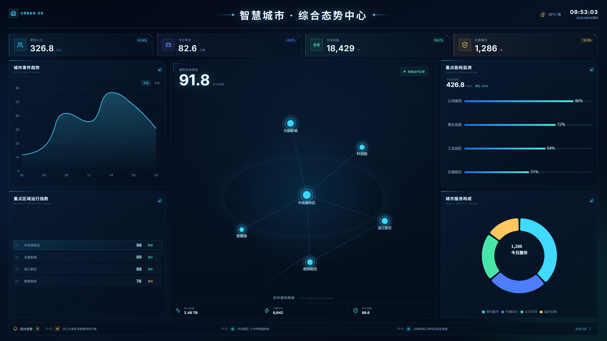

# DataV Template Vue 3

一个基于 **Vue 3、TypeScript 与 ECharts** 构建的数据可视化大屏模板。项目提供自适应容器、通用图表封装和模块化页面示例，帮助开发者快速改造并生成符合自身需求的业务原型。

[](https://vuejs.org/)
[](https://www.typescriptlang.org/)
[](https://echarts.apache.org/)
[](./LICENSE)

> [在线预览：woo-niu.github.io/datav-template-vue3](https://woo-niu.github.io/datav-template-vue3/)

<p align="center">
  
</p>

## 项目介绍

> 本项目定位为**大屏开发模板**，重点提供自适应与模块化开发能力。页面中的城市运行数据和业务模块用于演示，可根据实际项目自由替换、增删与组合。

### 一套设计稿，自适应不同屏幕

项目默认以 **1920 × 1080** 为设计基准，通过 `ScreenContainer` 统一处理大屏缩放。当然，你也可以根据自己的设计稿传入自定义尺寸，详见[自适应容器用法](#自适应容器用法)。

- 使用 `ResizeObserver` 实时感知容器尺寸变化
- 同时计算宽度与高度缩放比，并取较小值进行等比缩放
- 始终保持设计稿比例，避免图表、文字和面板在不同分辨率下挤压变形
- 内容自动水平、垂直居中，剩余区域自然留白
- 支持浏览器窗口缩放、全屏切换及不同尺寸显示器
- 设计尺寸可通过组件参数调整，方便复用到其他大屏项目

```ts
const scale = Math.min(
  viewportWidth / designWidth,
  viewportHeight / designHeight,
);
```

这种方案保留了大屏设计稿的精确布局，无需为常见分辨率逐一编写媒体查询。

### 模块化开发，快速生成业务原型

示例页面按照“基础容器—通用面板—图表组件—业务模块”进行拆分。开发者可以保留整体视觉和自适应能力，仅替换所需模块的数据、图表配置与展示内容，快速搭建自己的业务原型。

- `ScreenContainer` 统一负责大屏自适应，无需业务模块重复处理缩放
- `DataPanel` 提供统一的面板外观与标题结构
- `ChartView` 封装 ECharts 初始化、更新、尺寸响应与销毁逻辑
- `dashboard` 目录按业务区域拆分组件，支持独立修改、删除或重新组合
- 页面布局与业务数据解耦，方便接入真实接口或状态管理方案

模板当前包含以下示例模块：

- 城市运行核心态势展示
- 核心指标概览卡片
- 城市事件趋势分析
- 重点区域运行指数
- 重点能耗监测
- 城市服务构成
- 实时告警信息栏
- 统一的科技感暗色主题与微动效

### 清晰、易扩展的工程结构

- 使用 Vue 3 Composition API 与 TypeScript
- ECharts 按需引入，统一封装图表生命周期与尺寸响应
- 自适应容器、通用面板、图表和业务模块分层拆分
- 支持 `prefers-reduced-motion`，尊重系统减少动态效果设置

## 技术栈

| 技术       | 用途               |
| ---------- | ------------------ |
| Vue 3      | 页面与组件开发     |
| TypeScript | 类型安全与开发体验 |
| Vite       | 本地开发与生产构建 |
| ECharts    | 数据图表与可视化   |
| Lucide Vue | 界面图标           |
| pnpm       | 依赖管理           |

## 快速开始

建议使用 Node.js 22 与 pnpm 10。

```bash
# 克隆项目
git clone https://github.com/woo-niu/datav-template-vue3.git

# 进入项目
cd datav-template-vue3

# 安装依赖
pnpm install

# 启动开发环境
pnpm dev
```

启动后访问 [http://localhost:5173](http://localhost:5173)。

## 常用命令

```bash
pnpm dev        # 启动开发服务器
pnpm build      # 类型检查并构建生产版本
pnpm preview    # 本地预览生产构建
pnpm typecheck  # 执行 TypeScript 类型检查
```

## 自适应容器用法

默认设计尺寸为 `1920 × 1080`：

```vue
<template>
  <ScreenContainer>
    <YourDashboard />
  </ScreenContainer>
</template>
```

也可以传入自定义设计稿尺寸：

```vue
<ScreenContainer :width="2560" :height="1440">
  <YourDashboard />
</ScreenContainer>
```

业务内容只需按照设计稿尺寸进行开发，缩放、居中和容器监听均由 `ScreenContainer` 负责。

## 项目结构

```text
datav-template-vue3/
├─ .github/workflows/       # GitHub Pages 自动部署
├─ src/
│  ├─ components/
│  │  ├─ dashboard/         # 大屏业务模块
│  │  ├─ ChartView.vue      # ECharts 通用封装
│  │  ├─ DataPanel.vue      # 数据面板容器
│  │  └─ ScreenContainer.vue# 大屏自适应容器
│  ├─ styles/               # 全局样式
│  ├─ App.vue               # 大屏页面布局
│  └─ main.ts               # 应用入口
├─ package.json
└─ vite.config.ts
```

## 二次开发

- 组合业务原型：在 `src/App.vue` 中增删模块或调整页面布局
- 修改展示内容：编辑 `src/components/dashboard` 下对应的示例业务组件
- 接入真实接口：将组件中的示例数据替换为接口或状态管理中的数据
- 新增图表模块：复用 `DataPanel` 与 `ChartView`，仅需关注业务内容和 ECharts 配置
- 调整主题：修改 `src/styles/main.css`、面板样式及 `chartTheme.ts`
- 调整设计稿尺寸：通过 `ScreenContainer` 的 `width`、`height` 属性配置
- 修改部署仓库名：同步调整 `vite.config.ts` 中的 `base`

## 浏览器支持

推荐使用最新版 Chrome、Edge、Firefox 或 Safari。项目依赖 `ResizeObserver` 完成容器尺寸监听，请确保目标浏览器支持该 API。

## 参与贡献

欢迎提交 Issue 和 Pull Request。如果这个项目对你有帮助，也欢迎点一个 Star。

## 开源协议

本项目基于 [MIT License](./LICENSE) 开源，可自由用于个人或商业项目。
